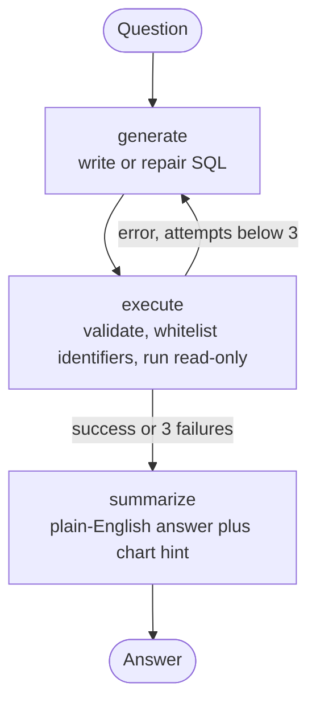

# Ask Your Data

**A text-to-SQL data analyst agent.** Ask a question in plain English; a LangGraph agent
writes the SQL, runs it against a read-only sandbox, repairs its own mistakes, and explains
the result with a table and a chart. Query the built-in sample shop, or upload your own CSV
files and pick which one to work with.

---

## Features

- **Natural language to SQL** — a LangGraph agent that **repairs its own errors** (up to 3 attempts)
- **Multiple datasets** — upload several CSVs, keep them side by side, choose the active one, preview its
  rows, and delete it from the panel. Every answer is scoped to the dataset you selected
- **Grounded answers** — hallucinated column names are caught before the query runs, so the agent never
  returns a confident answer built on a column that does not exist
- **Real type detection** — `$1,234.50`, `03/14/2025`, `yes/no` and blank cells become REAL, DATE,
  INTEGER and NULL, so `SUM`, `AVG` and month grouping work on the first try
- **Accounts** — scrypt password hashing, HMAC-signed session tokens, per-user chat history
- **Readable results** — sortable-width tables with aligned figures, an auto-chosen bar or line chart,
  highlighted SQL, a CSV download, and the agent's step trace
- **Safe by design** — SELECT-only, read-only connection, comment/literal-aware keyword blocking,
  identifier whitelisting, 5 s query timeout, 500-row cap, isolated database file per user
- **Professional UI** — light and dark themes, a dataset panel that never lets a long file name escape,
  keyboard shortcuts, toasts instead of browser alerts, and a mobile drawer

## How it works



1. Read the schema of the selected dataset — tables, columns, types, low-cardinality values, a sample row
2. The LLM writes one SELECT
3. The query is validated, its identifiers are checked against the real schema, and it runs read-only
4. Any failure goes back to the LLM with the error attached
5. The result is summarised from the actual rows, with a chart suggested when one helps

## Quick start

**Requirements:** Python 3.10+ and a free [Groq API key](https://console.groq.com).

```bash
git clone https://github.com/<your-username>/sql-analyst.git
cd sql-analyst
pip install -r requirements.txt
cd backend
cp .env.example .env        # Windows: copy .env.example .env
```

Edit `backend/.env`:

```
GROQ_API_KEY=gsk_your_key
GROQ_MODEL=openai/gpt-oss-120b
APP_SECRET=a-long-random-string
```

Generate a secret with `python -c "import secrets; print(secrets.token_hex(32))"`.

```bash
python -m uvicorn main:app --reload --port 8080
```

Open <http://localhost:8080>, sign up, and start asking. The first start takes up to a minute while
the libraries load.

> `.env` is read only at startup. Restart the server after editing it.

### Docker

```bash
docker build -t sql-analyst .
docker run -p 8000:8000 --env-file backend/.env sql-analyst
```

## Tests

```bash
python tests/test_app.py     # 71 API, ingestion and query-safety checks
python tests/ui_test.py      # 40 browser checks in Chromium (pip install playwright && playwright install chromium)
```

`tests/ui_test.py` starts its own server with a scripted LLM, drives the real UI, and writes
screenshots to `tests/shots/`. Neither suite needs a Groq key or touches your real database.

## Try it

**Sample shop:** "Top 5 customers by total spend", "Monthly revenue for 2025",
"Which country has the highest return rate?"

**Your own data:** switch to **My files**, drop in one or more CSVs, click the one you want to work
with, then ask "Total revenue by region", "Average resolution hours by team", or "Show me 10 rows".

Follow-ups work within a dataset: ask "revenue by category", then "only for the United States".

## Configuration

| Variable | Required | Default | Purpose |
|---|---|---|---|
| `GROQ_API_KEY` | Yes | none | LLM access |
| `GROQ_MODEL` | No | `openai/gpt-oss-120b` | Model name (change if Groq retires it) |
| `APP_SECRET` | Yes in production | dev placeholder | Signs login tokens |
| `ALLOWED_ORIGINS` | Only for a split deploy | localhost + the Vercel app | Comma-separated CORS origins |
| `DATA_DIR` | No | `backend/` | Where the SQLite files live — point it at a mounted disk so accounts and uploads survive a redeploy |

## Deploying

The backend serves the frontend, so a single service is enough.

- **Render (Docker):** build from this repo, set `GROQ_API_KEY` and `APP_SECRET`, and attach a disk
  mounted at `/var/data` with `DATA_DIR=/var/data`. Without a disk, the free plan wipes accounts and
  uploads on every deploy and after each cold start.
- **Split deploy (frontend on Vercel, API on Render):** the frontend detects a `*.vercel.app` host and
  calls the deployed API. Update that URL in `frontend/index.html` (`API_URL`) and list the frontend
  origin in `ALLOWED_ORIGINS`.

## Project structure

```
backend/
  main.py        FastAPI routes, auth dependency, static hosting
  agent.py       LangGraph text-to-SQL agent
  db.py          sample data, schema introspection, CSV ingestion, safe query runner
  auth.py        users, password hashing, tokens, chat history
  .env.example
frontend/
  index.html     the whole UI (auth, dataset panel, chat, charts)
  vendor/        Chart.js, served locally rather than from a CDN
tests/
  test_app.py    API + ingestion + safety suite
  ui_test.py     Playwright browser suite
  demo_server.py the app with a scripted LLM, for offline demos
Dockerfile
requirements.txt
```

## Security

Six layers on every generated query: SELECT/`WITH` only, a keyword blocklist applied after comments and
string literals are stripped, an identifier whitelist built from the live schema, a read-only SQLite
connection, a 5 s timeout, and a 500-row cap. Passwords use scrypt; sessions are HMAC-signed tokens;
each account's uploads live in their own database file.

**Privacy note:** the schema, one sample row of the selected dataset, your question, earlier SQL for
follow-ups, and the first 20 result rows are sent to the LLM provider (Groq). Do not upload confidential
data you are not willing to share with that provider.

## Limits

5 MB per file, 50,000 rows, 60 columns, 10 datasets per account. CSV, TSV or TXT
(in Excel: File > Save As, CSV).

## Tech stack

Python, FastAPI, LangGraph, LangChain-Groq, SQLite, vanilla JavaScript, Chart.js.
