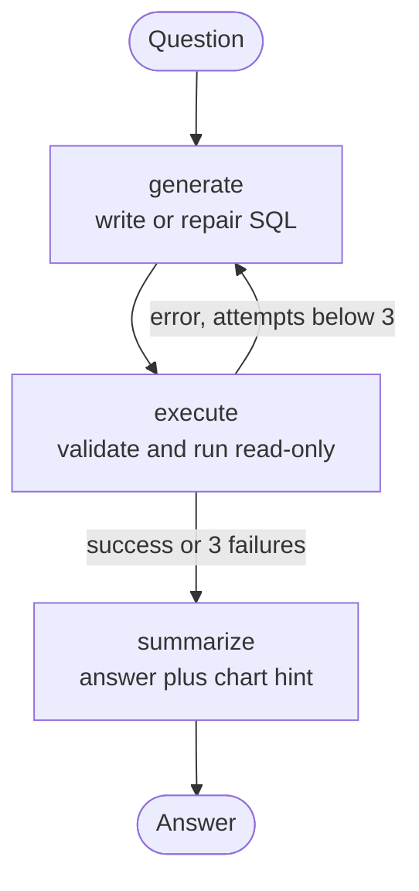

# Ask Your Data

**A text-to-SQL data analyst agent.** Ask questions about a database in plain English and get the SQL, the data, a chart and a written answer. Query the built-in sample shop or upload your own CSV files.

---

## Features

- **Natural language to SQL** with a LangGraph agent that **repairs its own errors** (up to 3 attempts)
- **Bring your own data:** upload CSVs into a private per-user sandbox; types are detected automatically
- **Signup and login** with hashed passwords and signed session tokens
- **Chat interface** with saved per-user history and follow-up questions
- **Results you can read:** table, auto-chosen bar or line chart, highlighted SQL, and an agent step trace
- **Safe by design:** SELECT-only, read-only connection, 5 s timeout, 500-row cap
- **Responsive light pastel UI** with a schema explorer and a mobile drawer

## How it works



1. Read the schema (tables, columns, allowed values)
2. The LLM writes one SELECT query
3. The query runs in a read-only sandbox
4. If it fails, the error goes back to the LLM to fix
5. The result is summarised in plain English with a chart suggestion

## Quick start

**Requirements:** Python 3.10+ and a free [Groq API key](https://console.groq.com).

```bash
git clone https://github.com/<your-username>/sql-analyst.git
cd sql-analyst
pip install -r requirements.txt
cd backend
cp .env.example .env        # Windows: copy .env.example .env
```

Edit `backend/.env` (one setting per line, no quotes):

```
GROQ_API_KEY=gsk_your_key
GROQ_MODEL=openai/gpt-oss-120b
APP_SECRET=a-long-random-string
```

Generate a secret with `python -c "import secrets; print(secrets.token_hex(32))"`.

```bash
python -m uvicorn main:app --reload --port 8080
```

Open http://localhost:8080, sign up, and start asking. The first start takes up to a minute while the libraries load.

> `.env` is read only at startup. Restart the server after editing it.

### Docker

```bash
docker build -t sql-analyst .
docker run -p 8000:8000 --env-file backend/.env sql-analyst
```

## Try it

**Sample shop:** "Top 5 customers by total spend", "Monthly revenue for 2025", "Which country has the highest return rate?"

**Your own data:** switch to **My data**, upload a CSV, and ask "Show me 10 rows", "Average salary by department", or "Tickets created per month".

Follow-ups work: ask "revenue by category", then "only for the United States".

## Configuration

| Variable | Required | Default | Purpose |
|---|---|---|---|
| `GROQ_API_KEY` | Yes | none | LLM access |
| `GROQ_MODEL` | No | `openai/gpt-oss-120b` | Model name (change if Groq retires it) |
| `APP_SECRET` | Yes in production | dev placeholder | Signs login tokens |

## Project structure

```
backend/
  main.py     FastAPI routes, auth dependency, static hosting
  agent.py    LangGraph text-to-SQL agent
  db.py       sample data, schema introspection, safe query runner, CSV ingestion
  auth.py     users, password hashing, tokens, chat history
frontend/
  index.html  entire UI (auth, chat, upload, charts)
Dockerfile
.dockerignore
requirements.txt
DOCUMENTATION.md
```

## Security

Five query layers: SELECT/WITH only, keyword blocklist, read-only database connection, 5 s timeout, and a row cap. Passwords use scrypt; sessions are HMAC-signed tokens; each user's uploads live in an isolated database file.

**Privacy note:** the schema, one sample row of uploaded data, your question, earlier SQL for follow-ups, and the first 20 result rows are sent to the LLM provider (Groq). Do not upload confidential data you are not willing to share with that provider.

## Limits

5 MB per file, 50,000 rows, 60 columns, 5 tables per user. CSV only (in Excel: Save As, CSV).

## Tech stack

Python, FastAPI, LangGraph, LangChain-Groq, SQLite, vanilla JavaScript, Chart.js.
